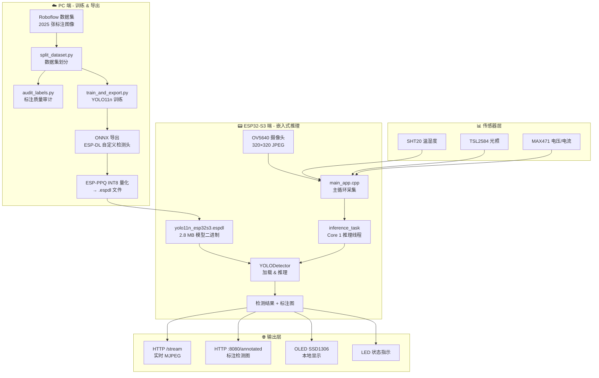
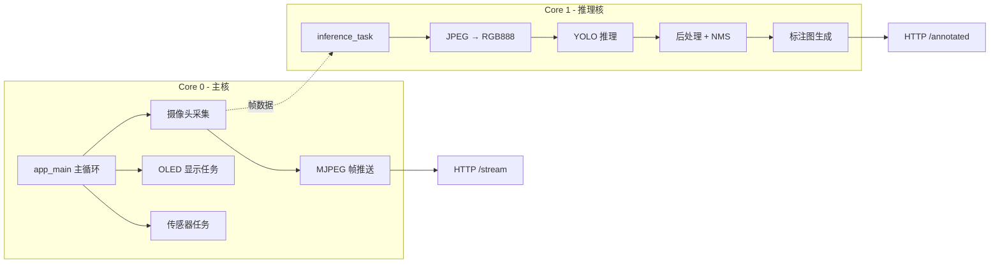
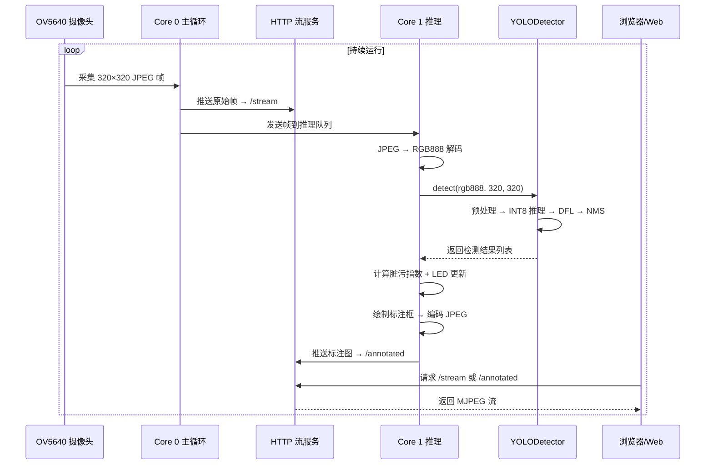

# 🔬 光伏板边缘 AI 监测系统 — 项目全流程解读

## 一句话总结

> 这是一个**从数据集准备 → 模型训练 → 量化导出 → ESP32-S3 嵌入式部署 → Web 实时展示**的完整边缘 AI 项目。核心是在一块只有几 MB 内存的微控制器上运行 YOLO11n 目标检测模型，识别光伏板上的灰尘、鸟粪、积雪、物理/电气损伤。

---

## 项目整体架构



---

## 阶段一：数据集准备

### 1.1 数据来源

数据集来自 **Roboflow** 平台（[README.roboflow.txt](file:///d:/ESP32-IDF/esp32s3-cam/yolov11/README.roboflow.txt)），共 **2025 张** 光伏板图像，已经标注好 YOLO 格式的边界框。

### 1.2 类别定义（6 类）

在 [data.yaml](file:///d:/ESP32-IDF/esp32s3-cam/yolov11/data.yaml) 中定义：

| 类别 ID | 名称 | 含义 |
|:---:|:---|:---|
| 0 | `bird_drop` | 鸟粪 |
| 1 | `clean` | 清洁状态 |
| 2 | `dust` | 灰尘覆盖 |
| 3 | `electrical_damage` | 电气损伤 |
| 4 | `physical_damage` | 物理损伤 |
| 5 | `snow_covered` | 积雪覆盖 |

### 1.3 数据集划分 — [split_dataset.py](file:///d:/ESP32-IDF/esp32s3-cam/yolov11/split_dataset.py)

这个脚本做了**非常关键**的一件事——**防止数据泄露的智能划分**：

```
Train : Val : Test = 70% : 15% : 15%
```

**核心设计亮点**：
1. **按 source_id 分组**：Roboflow 增强后的图像文件名包含 `.rf.` 标记，同一原始图的所有增强版本被归为同一组，**绝不拆分到不同 split**，避免"训练集和验证集看到同一张原图的不同增强"导致的数据泄露。
2. **类别平衡策略**：按"稀有度"排序分组，优先将稀有类别图像分配到各 split，确保每个 split 的类别分布尽可能均衡。
3. **不移动文件**：只生成 `splits/train.txt`、`splits/val.txt`、`splits/test.txt` 清单文件，用相对路径指向原图，不复制图像。

### 1.4 标注质量审计 — [audit_labels.py](file:///d:/ESP32-IDF/esp32s3-cam/yolov11/audit_labels.py)

在训练前做一次**人工复查**：
- 每个类别随机抽样 50 个标注框
- 渲染成**联系卡片墙**（Contact Sheet），红框标记检测区域
- 输出到 `audit/` 目录，方便肉眼检查"标注有没有标错"
- 同时输出 `samples.csv` 记录所有抽样详情

> [!TIP]
> 这是训练好模型的基础。如果标注有大量错误（比如 dust 标成了 clean），模型再怎么训也学不好。

---

## 阶段二：模型训练

### 2.1 训练脚本 — [train_and_export.py](file:///d:/ESP32-IDF/esp32s3-cam/yolov11/train_and_export.py)

这是一个**一键脚本**，包含三大步骤：训练 → ONNX 导出 → INT8 量化。

### 2.2 STEP 1: YOLO11n 训练

```python
model = YOLO("yolo11n.pt")    # 加载 Ultralytics 官方预训练权重
results = model.train(**TRAIN_CFG)
```

**关键超参数解读**：

| 参数 | 值 | 说明 |
|:---|:---:|:---|
| `imgsz` | 320 | 输入分辨率，和 ESP32 摄像头一致 |
| `epochs` | 100 | 训练轮数 |
| `batch` | 32 | 批大小 |
| `optimizer` | AdamW | 优化器选择 |
| `cos_lr` | True | 余弦退火学习率调度 |
| `patience` | 20 | 早停：验证集指标连续 20 轮不提升就停止 |
| `pretrained` | True | 使用 COCO 预训练权重做迁移学习 |
| `mosaic` | 0.15 | Mosaic 数据增强概率 |
| `dropout` | 0.18 | 防过拟合的 Dropout |

> [!IMPORTANT]
> **迁移学习**是这里的核心策略：不是从零训练，而是加载在 COCO 大数据集上预训练过的 `yolo11n.pt`，然后在光伏板数据集上微调。这样即使只有 2000+ 张图，也能获得不错的效果。

### 2.3 数据增强策略

训练配置中包含丰富的数据增强：

```
HSV 色调/饱和度/亮度变换 → 模拟不同光照条件
旋转/平移/缩放/剪切     → 模拟不同拍摄角度
水平翻转                → 增加样本多样性
Mosaic 拼接             → 让模型一次看到多张图的目标
MixUp 混合              → 两张图叠加训练
Copy-Paste              → 将目标复制粘贴到其他背景
Random Erasing          → 随机遮挡部分区域
```

---

## 阶段三：模型导出（适配 ESP32）

### 3.1 STEP 2: 导出 ESP-DL 兼容 ONNX

这是**最关键的适配步骤**。标准 YOLO 的检测头在输出时会做 DFL 解码和 NMS，这些操作在 ESP32 上无法高效运行，所以需要**自定义检测头**：

```python
class ESP_Detect(Detect):
    def forward(self, x):
        return (
            self.cv2[0](x[0]), self.cv3[0](x[0]),  # stride 8: box + score
            self.cv2[1](x[1]), self.cv3[1](x[1]),  # stride 16: box + score
            self.cv2[2](x[2]), self.cv3[2](x[2]),  # stride 32: box + score
        )
```

**做了什么**：
- 把 YOLO 的**三个检测尺度**（8倍、16倍、32倍下采样）分别输出 `box`（边界框回归）和 `score`（分类得分）
- **移除 DFL 解码**，留到 C++ 后处理代码中做
- **移除 NMS**，也在 C++ 中实现

**输出 6 个张量**：`box0, score0, box1, score1, box2, score2`

### 3.2 Attention 模块适配

YOLO11 引入了 Attention 机制，标准实现中用了 `torch.nn.functional.scaled_dot_product_attention`，这个算子 ONNX 不支持，所以用 `ESP_Attention` 类手动展开：

```python
attn = (q.transpose(-2, -1) @ k) * self.scale
attn = attn.softmax(dim=-1)
x = (v @ attn.transpose(-2, -1)).view(...)
```

### 3.3 STEP 3: INT8 量化

```python
espdl_quantize_onnx(
    onnx_import_file=ONNX_NAME,
    espdl_export_file=ESPDL_NAME,
    calib_dataloader=calib_loader,
    target="esp32s3",
    num_of_bits=8,        # INT8 量化
)
```

**为什么要量化**：
- ESP32-S3 没有浮点加速器，FP32 推理极慢
- INT8 量化后模型体积缩小约 4 倍，推理速度提升数倍
- 用验证集的 200 张图片做**校准**（calibration），统计每层的数值范围，确定量化参数

**最终产物**：`solar_panel_yolo11n.espdl`（约 2.8 MB），自动复制到 `main/model/yolo11n_esp32s3.espdl`。

---

## 阶段四：嵌入式部署

### 4.1 整体固件架构



### 4.2 主程序 — [main_app.cpp](file:///d:/ESP32-IDF/esp32s3-cam/main/main_app.cpp)

启动顺序：
1. NVS Flash 初始化
2. WiFi 连接
3. OV5640 摄像头初始化
4. LED 指示灯初始化
5. I2C 总线初始化 → OLED 初始化
6. 启动 OLED 显示任务（当前用随机模拟数据）
7. 启动 HTTP 流媒体服务器
8. 启动推理任务（Core 1）
9. 主循环：不断采集摄像头帧 → 推送到视频流 + 推理队列

### 4.3 推理任务 — [inference_task.cpp](file:///d:/ESP32-IDF/esp32s3-cam/main/inference_task/inference_task.cpp)

运行在 **Core 1**（与主循环分核），流程：

```
等待新帧信号量 → 取出 JPEG 数据 → JPEG 解码为 RGB888 
→ 调用 YOLODetector::detect() → 获得检测结果
→ 计算脏污指数 & 告警优先级 → LED 状态更新
→ 绘制标注框 → 编码回 JPEG → 推送到 /annotated 端点
```

**脏污指数计算**（已在推理任务中实现）：
```cpp
dirt_index = Σ(框面积 × 类别权重) / 图像面积 × 100%
```

类别权重定义在 [yolo_classes.h](file:///d:/ESP32-IDF/esp32s3-cam/main/yolo_classes.h)：
- `bird_drop` → 1.5（鸟粪权重高）
- `dust` → 1.0（灰尘标准权重）
- `clean` → 0.0（不增加脏污指数）
- 其他 → 0.0（损伤类别不参与脏污计算，走告警逻辑）

### 4.4 YOLO 检测器 — [yolo_detect.cpp](file:///d:/ESP32-IDF/esp32s3-cam/main/yolo_detect/yolo_detect.cpp)

负责：
- 加载 `.espdl` 模型文件
- 图像预处理（resize 到 320×320，归一化 /255.0）
- 调用 ESP-DL 库执行 INT8 推理
- DFL 解码 + NMS 后处理
- 在 RGB 图上绘制检测框和标签
- 将标注图编码为 JPEG

### 4.5 Web 仪表盘 — [dashboard.html](file:///d:/ESP32-IDF/esp32s3-cam/main/dashboard.html)

嵌入到固件中的单页 Web 界面，通过浏览器访问 ESP32 的 IP 即可查看：
- 实时摄像头视频流
- AI 检测标注图
- 传感器数据（温湿度、光照、电压电流）
- 控制按钮

---

## 阶段五：完整数据流



---

## 关键文件索引

### 训练相关（PC 端）

| 文件 | 作用 |
|:---|:---|
| [data.yaml](file:///d:/ESP32-IDF/esp32s3-cam/yolov11/data.yaml) | 数据集配置：类别名、路径 |
| [split_dataset.py](file:///d:/ESP32-IDF/esp32s3-cam/yolov11/split_dataset.py) | 防泄露数据集划分 |
| [audit_labels.py](file:///d:/ESP32-IDF/esp32s3-cam/yolov11/audit_labels.py) | 标注质量审计 |
| [train_and_export.py](file:///d:/ESP32-IDF/esp32s3-cam/yolov11/train_and_export.py) | 一键训练+导出+量化 |
| [yolo11n.pt](file:///d:/ESP32-IDF/esp32s3-cam/yolov11/yolo11n.pt) | YOLO11n 预训练权重 |

### 部署相关（ESP32 端）

| 文件 | 作用 |
|:---|:---|
| [main_app.cpp](file:///d:/ESP32-IDF/esp32s3-cam/main/main_app.cpp) | 固件入口，初始化 + 主循环 |
| [inference_task.cpp](file:///d:/ESP32-IDF/esp32s3-cam/main/inference_task/inference_task.cpp) | Core 1 推理线程 |
| [yolo_detect.cpp](file:///d:/ESP32-IDF/esp32s3-cam/main/yolo_detect/yolo_detect.cpp) | YOLO 模型加载 + 推理 + 后处理 |
| [yolo_classes.h](file:///d:/ESP32-IDF/esp32s3-cam/main/yolo_classes.h) | 6 类定义 + 权重 + 告警优先级 |
| [yolo11n_esp32s3.espdl](file:///d:/ESP32-IDF/esp32s3-cam/main/model/yolo11n_esp32s3.espdl) | 量化后的模型二进制（2.8 MB） |
| [dashboard.html](file:///d:/ESP32-IDF/esp32s3-cam/main/dashboard.html) | 嵌入式 Web 仪表盘 |

---

## 你最关心的：模型训练到底是怎么做的？

### 完整流程总结

```
1. 收集数据
   └─ Roboflow 平台标注 2025 张光伏板图像，6 个类别

2. 数据质量保障
   ├─ split_dataset.py  → 按原图 source_id 分组，防止数据泄露
   └─ audit_labels.py   → 抽样生成 Contact Sheet，人工复查标注

3. 模型训练
   ├─ 加载 yolo11n.pt 预训练权重（迁移学习）
   ├─ 在 320×320 分辨率上训练 100 epochs
   ├─ 使用丰富数据增强（Mosaic/MixUp/Copy-Paste/HSV变换...）
   ├─ AdamW + 余弦退火学习率
   └─ 早停 patience=20，防止过拟合

4. 模型导出（适配 ESP32）
   ├─ 替换检测头 → ESP_Detect（分离 box/score，移除 DFL）
   ├─ 替换 Attention → ESP_Attention（手动展开，避免不支持的算子）
   └─ 导出为 ONNX（6 个输出：3 尺度 × box + score）

5. INT8 量化
   ├─ 用 200 张验证集图片做校准
   ├─ ESP-PPQ 量化框架
   └─ 输出 .espdl 文件（~2.8 MB）

6. 嵌入式部署
   ├─ .espdl 文件嵌入固件
   ├─ ESP-DL 库加载模型
   ├─ C++ 实现 DFL 解码 + NMS 后处理
   └─ 双核运行：Core 0 采集 + Core 1 推理
```

> [!NOTE]
> 整个训练流程的核心思想是：**用 PC 上的 GPU 完成计算密集的训练工作，然后通过"模型瘦身"（量化到 INT8）把模型压缩到 ESP32 能跑的大小**。这就是所谓的"边缘 AI"——推理发生在设备端，不需要联网调用云端 API。

---

## 当前项目状态与待完成事项

### ✅ 已完成
- 数据集准备与标注
- YOLO11n 模型训练
- ONNX 导出 + INT8 量化
- ESP32-S3 本地推理运行
- HTTP 视频流 + 标注图输出
- Web 仪表盘基础版
- OLED 显示（模拟数据）
- LED 状态指示
- 脏污指数计算 + 告警优先级

### ❌ 待完成（见[开发计划](file:///d:/ESP32-IDF/esp32s3-cam/ziliao/%E7%AB%9E%E8%B5%9B%E9%A1%B9%E7%9B%AE%E9%87%8D%E5%AE%9A%E4%BD%8D%E4%B8%8E%E5%BC%80%E5%8F%91%E8%AE%A1%E5%88%92.md)）
- 真实传感器数据接入（SHT20/TSL2584/MAX471 被注释）
- 清洁决策融合逻辑（视觉 + 功率衰减）
- 执行器联动（继电器/电机/水泵控制）
- MQTT 通信
- Web API 控制接口
- 竞赛设计文档 & 视频
